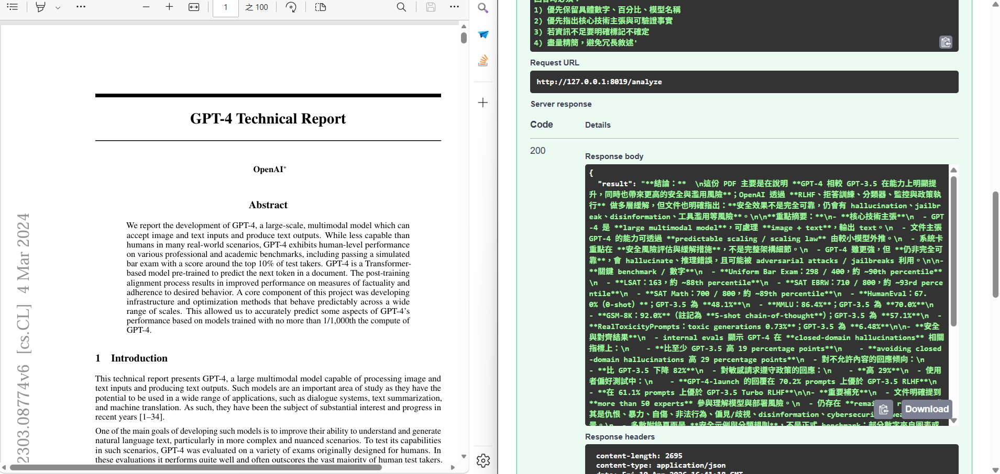

# pdf-litellm-parser

A FastAPI service that analyzes multiple PDF files using LiteLLM vision model (gpt-5.4-mini).

## 專案說明

本服務提供單一 endpoint，接收多份 PDF 檔案及一個 prompt，將每頁 PDF 轉成 PNG 圖片後透過 LiteLLM 傳給視覺模型進行分析。

### 技術棧

- **Backend**: FastAPI
- **LLM**: gpt-5.4-mini via LiteLLM (vision capable)
- **PDF 處理**: PyMuPDF (fitz)
- **並行處理**: ThreadPoolExecutor

### 功能特色

- 接收多份 PDF（`multipart/form-data`，欄位名 `files`）
- 接收 prompt 字串（欄位名 `prompt`）
- 每份 PDF 使用 pymupdf (fitz) 以 DPI 100 將每頁轉成 PNG，base64 編碼
- Image detail 固定為 `high`（提升文字密集頁的擷取品質）
- 多份 PDF 的頁面轉換使用 `ThreadPoolExecutor` 並行處理
- 所有頁面圖片組成 content array 連同 prompt 送給 LiteLLM

## 安裝方式

### 前置需求

- Python 3.9+
- `uv`（Python 套件與虛擬環境管理）
- AOAI / OpenAI 相容 API Key

### 步驟

```bash
# 進入專案目錄
cd projects/pdf-litellm-parser

# 建立虛擬環境
uv venv

# 安裝相依套件
uv pip install -r requirements.txt
```

### 環境變數

```bash
# 模型（可省略，預設 gpt-5.4-mini）
export LITELLM_MODEL=gpt-5.4-mini

# 單次請求最多圖片數（預設 50，避免超出 provider 圖片上限）
export LITELLM_MAX_IMAGES=50

# 分批分析每批頁數（預設 20）
export LITELLM_MAP_BATCH_SIZE=20

# 分批重疊頁數（預設 0，建議 2~5 可提升跨頁穩定性）
export LITELLM_MAP_BATCH_OVERLAP=0

# 分批並行數（預設 2；越大越快，但更容易遇到 rate limit）
export LITELLM_MAP_MAX_WORKERS=2

# 每個 batch 結果進入 merge 前的最大字元數（預設 3000）
export LITELLM_MERGE_MAX_CHARS_PER_BATCH=3000

# 每批分析輸出上限 token（預設 900）
export LITELLM_BATCH_MAX_TOKENS=900

# 最終 merge 輸出上限 token（預設 1200）
export LITELLM_MERGE_MAX_TOKENS=1200

# 圖片解析度固定使用 high（目前程式固定）

# 單次 LLM 請求逾時秒數（預設 90）
export LITELLM_TIMEOUT=90

# 預設 system prompt（可由 /analyze 的 system_prompt 覆寫）
export LITELLM_SYSTEM_PROMPT="你是一個專業的文件分析助理，請嚴格根據提供的內容回答，不要推測。"

# AOAI/OpenAI 相容 endpoint（例如: https://<host>/openai/v1）
export AOAI_API_BASE=https://<your-endpoint>/openai/v1

# 金鑰
export AOAI_API_KEY=<your-api-key>
```

Windows PowerShell:

```powershell
$env:LITELLM_MODEL = "gpt-5.4-mini"
$env:LITELLM_MAX_IMAGES = "50"
$env:LITELLM_MAP_BATCH_SIZE = "20"
$env:LITELLM_MAP_BATCH_OVERLAP = "0"
$env:LITELLM_MAP_MAX_WORKERS = "2"
$env:LITELLM_MERGE_MAX_CHARS_PER_BATCH = "3000"
$env:LITELLM_BATCH_MAX_TOKENS = "900"
$env:LITELLM_MERGE_MAX_TOKENS = "1200"
$env:LITELLM_TIMEOUT = "90"
$env:LITELLM_SYSTEM_PROMPT = "你是一個專業的文件分析助理，請嚴格根據提供的內容回答，不要推測。"
$env:AOAI_API_BASE = "https://<your-endpoint>/openai/v1"
$env:AOAI_API_KEY = "<your-api-key>"
```

說明：若你貼的是 `.../openai/v1/responses`，程式會自動正規化成 `.../openai/v1` 後再呼叫 LiteLLM。

## 使用方式

```bash
# 啟動開發伺服器（預設 port 8000）
uv run uvicorn main:app --reload
```

服務啟動後，可透過以下網址存取：

| 端點 | URL |
|------|-----|
| 分析 PDF | http://localhost:8000/analyze |
| 健康檢查 | http://localhost:8000/health |
| API 文件 | http://localhost:8000/docs |

### 介面截圖



### 範例請求

```bash
curl -X POST http://localhost:8000/analyze \
  -F "files=@document1.pdf" \
  -F "files=@document2.pdf" \
  -F "prompt=請摘要這些文件的主要內容" \
  -F "focus_prompt=特別找出：核心技術貢獻、關鍵 benchmark 數字、最重要 claims。" \
  -F "system_prompt=你是學術研究助理，請找出核心主張、關鍵數據與技術貢獻。"
```

### 範例回應

```json
{
  "result": "這兩份文件主要討論...",
  "pages_processed": 5,
  "batch_count": 1,
  "token_usage": {
    "prompt_tokens": 1234,
    "completion_tokens": 456,
    "total_tokens": 1690
  },
  "elapsed_ms": 4821,
  "image_detail": "high",
  "model": "gpt-5.4-mini"
}
```

## API 規格

### POST /analyze

| 欄位 | 類型 | 說明 |
|------|------|------|
| `files` | `File[]` | 一或多份 PDF 檔案（multipart/form-data） |
| `prompt` | `string` | 傳送給模型的提示詞 |
| `focus_prompt` | `string` | 可調層焦點（例如核心主張/風險點/法規條文） |
| `system_prompt` | `string` | 控制模型解析策略（可選，未提供時採預設） |

**回應**：

```json
{
  "result": "<模型回應>",
  "pages_processed": <實際送入模型頁數>,
  "pages_extracted_total": <從 PDF 擷取總頁數>,
  "pages_truncated": <被截斷頁數>,
  "batch_count": <分批數>,
  "token_usage": {
    "prompt_tokens": <prompt tokens>,
    "completion_tokens": <completion tokens>,
    "total_tokens": <total tokens>
  },
  "elapsed_ms": <整體處理毫秒>,
  "image_detail": "high",
  "model": "gpt-5.4-mini"
}
```

當 PDF 總頁數超過 `LITELLM_MAX_IMAGES` 時，系統會自動切成多批（每批不超過上限）並行分析，最後再做整合，避免 `Too many images` 錯誤。

### GET /health

健康檢查端點，回傳 `{"status": "ok"}`。
